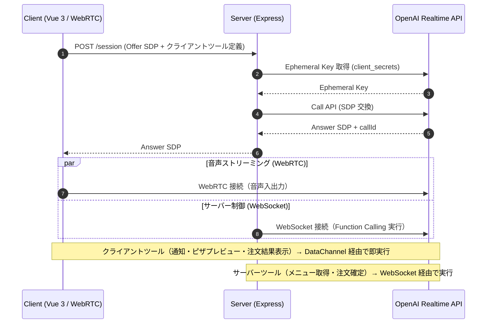

# AI ピッツェリア — 音声ピザ注文コンシェルジュ

OpenAI Realtime API を利用した音声対話型コンシェルジュのサンプルプロジェクトです。
**クライアント（Vue 3）** と **サーバー（TypeScript / Express）** の 2 層構成で、
Function Calling をクライアント側・サーバー側に分けて実装する実践的なアーキテクチャを解説します。

---

## 全体アーキテクチャ



## ディレクトリ構成

```
realtime-api-tutorial/
├── docker-compose.yml          # サービス定義
├── .env.example                # 環境変数テンプレート
├── .mise.toml                  # mise ランタイム設定 (Node.js 24)
├── .node-version               # nodenv / fnm / nvm 用 Node.js バージョン指定
│
├── server/                     # サーバー (TypeScript / Express)
│   ├── Dockerfile
│   ├── package.json
│   ├── tsconfig.json
│   └── main/
│       ├── main.ts                           # エントリーポイント (Express)
│       ├── env.ts                            # 環境変数
│       ├── api/
│       │   └── realtimeApiClient.ts          # OpenAI Realtime API クライアント
│       ├── session/
│       │   ├── realtimeSession.ts            # セッション管理（ツールマージ）
│       │   └── instructions.md               # システムプロンプト
│       ├── websocket/
│       │   └── openaiWebsocket.ts            # WebSocket 接続 & FC ディスパッチ
│       ├── function-calling/
│       │   ├── toolRegistry.ts               # ツール登録・実行・Zod→JSON Schema 変換
│       │   ├── types.ts                      # FC 型定義
│       │   └── tools/
│       │       ├── index.ts                  # ツール一覧（ここに追加すると自動登録）
│       │       ├── searchMenu.ts             # ピザメニュー取得
│       │       └── placeOrder.ts             # 注文確定（金額計算・注文 ID 発行）
│       ├── mock/
│       │   └── data.ts                       # モックデータ（メニュー・注文）
│       └── logger/
│           └── logger.ts                     # ロガー (pino)
│
└── client/                     # クライアント (Vue 3 + Vite)
    ├── Dockerfile
    ├── package.json
    ├── tsconfig.json
    ├── vite.config.ts
    ├── index.html
    └── src/
        ├── main.ts
        ├── App.vue                           # メイン画面（接続制御・テキスト入力）
        ├── types.ts                          # 共通型定義
        ├── composables/
        │   └── useRealtimeConnection.ts      # WebRTC 接続管理 Composable
        ├── tools/
        │   └── clientTools.ts               # クライアント側ツール定義・実行
        └── components/
            ├── ConversationPanel.vue          # 会話ログ
            ├── PizzaPreviewPanel.vue          # ピザプレビュー・注文結果
            ├── MenuPanel.vue                  # メニュー表示
            └── NotificationToast.vue          # 通知トースト
```

## Function Calling 一覧

### サーバー側 Function Calling

サーバー側で実行され、結果が WebSocket 経由で RealtimeAPI に返されるツール。

| ツール名      | 説明                                         | 主なパラメーター       |
| ------------- | -------------------------------------------- | ---------------------- |
| `search_menu` | ピザメニュー一覧・追加トッピング選択肢を取得 | なし                   |
| `place_order` | 注文確定（金額計算・注文 ID 発行）           | customer_name, items[] |

### クライアント側 Function Calling

クライアント端末で実行され、結果が DataChannel 経由で RealtimeAPI に返されるツール。

| ツール名            | 説明                                         | 主なパラメーター                          |
| ------------------- | -------------------------------------------- | ----------------------------------------- |
| `show_notification` | 通知メッセージを画面に表示                   | title, message, type                      |
| `show_menu`         | ピザメニューと追加トッピング一覧を画面に表示 | menu, extra_toppings, sauces              |
| `preview_pizza`     | ピザのリアルタイムプレビューを表示           | pizza_name, size, toppings                |
| `show_order_result` | 注文完了後に注文結果パネルを表示             | order_id, items, total, estimated_minutes |

## セットアップ

### 前提条件

- [Docker Desktop](https://www.docker.com/products/docker-desktop/)（Docker Compose v2 含む）

### 1. リポジトリのクローン

```bash
git clone -b v1 https://github.com/akiraNuma/realtime-api-tutorial
cd realtime-api-tutorial
```

> `-b v1` で本書に対応するバージョンのコードを取得します。最新の `main` ブランチは改訂等で内容が変わる場合があります。

### 2. 環境変数を設定

```bash
cp .env.example .env
# .env を編集して OPENAI_API_KEY を設定
```

> `OPENAI_API_KEY` は Realtime API が有効なキーが必要です。

### 3. 起動

```bash
docker compose up
```

| サービス     | URL                      |
| ------------ | ------------------------ |
| クライアント | http://localhost:5173    |
| サーバー     | http://localhost:9876    |

ソースコードの変更はホットリロードで即反映されます（`volumes` でマウント済み）

<details>
<summary><strong>Docker を使わずローカルで開発する場合</strong></summary>

Node.js 24 が必要です。お使いのバージョンマネージャーに合わせてインストールしてください。

| ツール | コマンド | 備考 |
|--------|---------|------|
| **mise**（推奨） | `mise trust && mise install` | `.mise.toml` を読み取り |
| nodenv | `nodenv install` | `.node-version` を読み取り |
| nvm | `nvm install && nvm use` | `.node-version` を読み取り |

> **mise をお使いの方へ**: 初回クローン後に `mise trust` が必要です。mise はセキュリティのため、未知のディレクトリの `.mise.toml` を信頼するか確認を求めます。`mise trust` を実行すると以降はエラーが出なくなります。

```bash
# サーバー起動
cd server
npm install
npm run server

# クライアント起動（別ターミナル）
cd client
npm install
npm run dev
```

クライアントの Vite は `/api` へのリクエストを `http://localhost:9876` にプロキシします（`vite.config.ts`）。

</details>

## 使い方

1. ブラウザで http://localhost:5173 を開く
2. 「🎙️ 会話を始める」ボタンを押す（マイク許可が求められます）
3. 音声で話しかける：
   - 「**マルゲリータの M サイズをください**」
   - 「**ペパロニにマッシュルームを追加して**」
   - 「**おすすめのピザを教えて**」
   - 「**それで注文お願い**」
4. AI が Function Calling を通じてメニュー取得・プレビュー表示・注文確定を実行します
5. 画面下部のデバッグトグルで Function Calling の実行ログを確認できます
